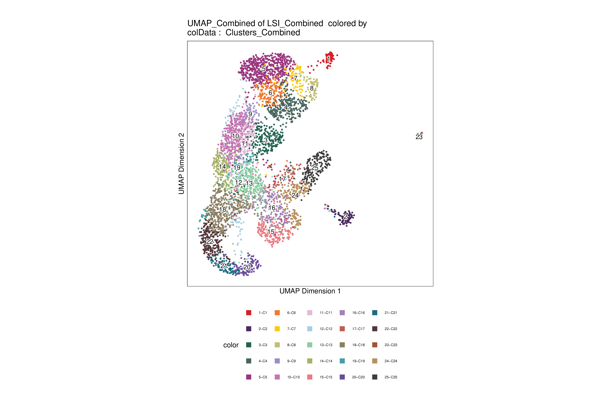
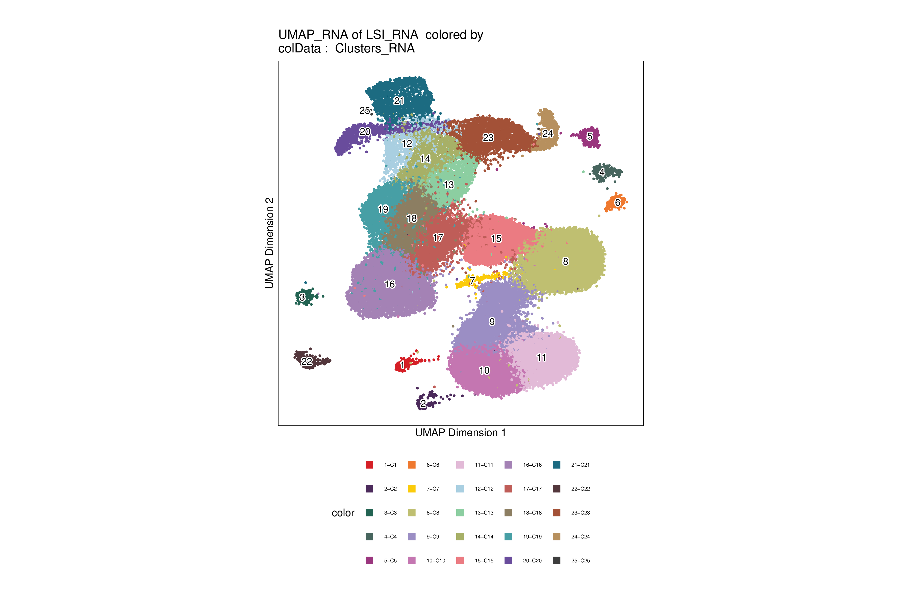
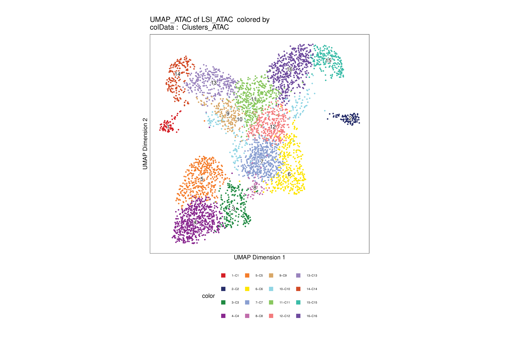

# Astrocyte multiomics data: preprocessing for scenic+ 

### Filtering Thresholds

We used the following filtering criteria: 

* **Minimum TSS enrichment**: Ensures sufficient transcription start site (TSS) signal for ATAC-seq data. Default is **10**.
* **Minimum number of fragments**: Filters out cells with too few ATAC-seq fragments. Default is **5000**.
* **Minimum number of genes detected in RNA-seq**: Excludes low-quality cells with sparse transcript coverage. Default is **1000**.
* **Maximum number of genes detected in RNA-seq**: Removes potential multiplets or highly overexpressed cells. Default is **7000**.
* **Minimum number of UMIs in RNA-seq**: Ensures sufficient sequencing depth per cell. Default is **1500**.
* **Maximum number of UMIs in RNA-seq**: Filters out cells with abnormally high counts that may indicate doublets. Default is **30000**.

[pre filter](figures/Astrocyte_preFilterQC.pdf)

[post filter](figures/Astrocyte_postFilterQC.pdf)

## UMAPs

